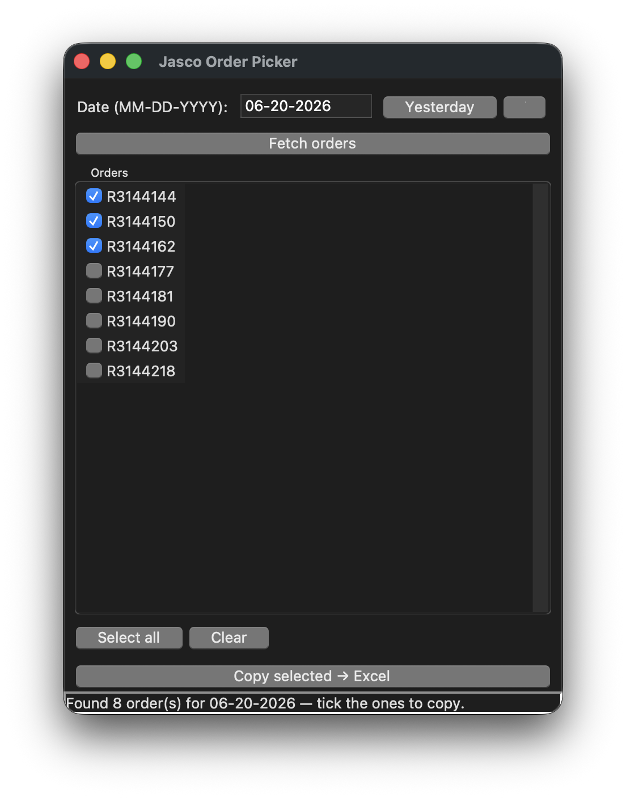

# Jasco Order Sync

**Browser-automation tool that replaces a ~1-hour daily manual data-entry task with a one-command (or one-click) sync.**

Every day, a small wholesale business had to log into the Mississippi Department of
Revenue [Taxpayer Access Point](https://tap.dor.ms.gov/_/) (TAP), open each of the
previous day's submitted retail orders one by one, export it, and hand-copy the line
items into a master Excel workbook. This tool does the whole thing end to end — and
because it dedupes and backs up on every write, it's safe to run unattended on a
schedule.

> **Impact:** ~60 minutes of daily manual copying → ~2 minutes (≈1 hour saved per day).
> Runs fully unattended after a one-time login.

**Stack:** Python · Playwright (headless Chromium) · openpyxl · Tkinter · launchd · ODS/XLSX

---

<p align="center">
  
  <br>
  <sub><i>The on-demand picker — choose a date, tick which orders to copy, one click to Excel. (Order numbers shown are placeholders.)</i></sub>
</p>

## What it does

1. **Logs into TAP.** A *persistent* browser profile stores the "Trust this device"
   cookie, so the SMS-MFA step only happens on the **first** run — every run after is
   credential-free and unattended.
2. **Filters the order list** to a single day's submitted reserve-inventory orders.
3. **Walks every matching order:** opens it, clicks Export (which fires an `.ods`
   download via a popup), and recovers the order number from the detail page.
4. **Appends the line items** to the `Pending` sheet of `Order.xlsx`, matching the
   exact layout the owner maintained by hand:

   | Col | Value | Source |
   | --- | ----- | ------ |
   | `A` | Item # | ODS col A |
   | `B` | Name | ODS col B |
   | `C` | `=VLOOKUP(A{row},SizeData!A$1:B$3974,2,FALSE)` | generated formula |
   | `D` | Reserved Quantity | ODS col H |
   | `E` | Order # | scraped from the order page |
   | `F` | Date | the target day, as an Excel date |

5. **Backs up first, never clobbers.** A timestamped copy of the workbook is written to
   `backups/` before any in-place save; if nothing new came in, the workbook is left
   untouched.
6. **Idempotent.** Orders whose number is already in column `E` are skipped, so re-runs
   (or overlap between the scheduled job and the manual picker) can never double-enter.

## How it works

```
          ┌─────────────┐      ┌──────────────┐      ┌──────────────┐
 run.py ─▶│ tap_scraper  │ ───▶ │  ods_parser  │ ───▶ │  xlsx_writer │ ──▶ Order.xlsx
 pick.py  │ (Playwright) │ .ods │ (rows, no    │ rows │ (append,     │     + backups/
          │  login/      │      │  totals row) │      │  dedupe,     │
          │  filter/     │      └──────────────┘      │  back up)    │
          │  iterate/    │                            └──────────────┘
          │  export)     │
          └─────────────┘
```

Both entry points (`run.py` and `pick.py`) share the **same** scraper, parser, and
writer, so their output — formatting, backups, the `VLOOKUP` column, the dedupe rule —
is byte-for-byte identical. The only difference is *which* orders they feed in.

## Engineering highlights

The hard part isn't clicking buttons — it's that TAP is a single-page JavaScript app
with a grid that re-renders asynchronously and **reshuffles its row order every time you
enter and leave an order.** Most of the code exists to make automation against that
reliable enough to trust unattended:

- **Select by identity, never by position.** The order grid reorders itself constantly,
  so every order is re-located by its order number on a fresh scan rather than by row
  index — eliminating the classic "clicked the wrong row after a re-render" bug.
- **Wait for *stable* state, not just *a* state.** The grid renders in stages, so a read
  taken too early sees a half-populated list. The scraper polls the row count until it
  stops changing (and until it reaches the known post-filter total) before trusting
  what's on screen — otherwise it would silently drop orders.
- **Guaranteed completeness.** It snapshots the full set of order numbers to process,
  then loops until every one is handled, paginating across list pages and retrying. It
  only gives up after several consecutive empty sweeps, and logs exactly which orders
  (if any) it couldn't reach — so a run is never quietly incomplete.
- **Resilient to flaky clicks.** The live site occasionally swallows a click while the
  grid is still settling; View and Export clicks are retried, and the export download is
  captured from **any** page — including the transient popup window TAP sometimes opens
  it in.
- **Resilient selectors.** Locators are role/name-based (recorded from `playwright
  codegen` against the live site) rather than brittle CSS/XPath, so ordinary markup
  churn doesn't break them.
- **Unattended-safe MFA.** The persistent profile makes MFA one-time. If the trust
  cookie ever expires, an unattended run detects that there's no terminal attached
  (`sys.stdin.isatty()`) and raises a clear `MFARequiredError` instead of hanging
  forever on an input prompt — the log tells you exactly how to re-establish trust.
- **Non-destructive by construction.** The writer copies the previous row's cell
  formatting onto new rows (replacing a manual "format painter" step), dedupes against
  existing order numbers, and snapshots a backup before every in-place save.

## Two ways to run

| | `run.py` — the daily job | `pick.py` — the picker |
| --- | --- | --- |
| **When** | Scheduled, unattended (launchd, midnight) | On demand, by hand |
| **Scope** | *Every* order from *yesterday* | A date *you* choose, *orders you tick* |
| **UI** | None (headless) | Tkinter window + double-click launcher |
| **For** | Set-and-forget automation | The non-technical owner, no terminal needed |

The picker lists a day's order numbers **without** exporting anything (a cheap
enumeration), so the owner can eyeball them and tick only the ones they want before any
download happens. Because the writer is idempotent, picking an order the daily job
already captured is a safe no-op.

## Tech stack

- **Python 3.11+**
- **[Playwright](https://playwright.dev/python/)** — drives headless Chromium with a
  persistent browser context (the key to one-time MFA)
- **[openpyxl](https://openpyxl.readthedocs.io/)** — reads/writes the `.xlsx` workbook,
  preserving styles and injecting formulas
- **Tkinter** — the zero-dependency desktop GUI for the picker
- **launchd** — macOS scheduling for the daily unattended run
- **ODS parsing** — reads the spreadsheet TAP exports per order

## Project layout

| File | Role |
| ---- | ---- |
| `run.py` | Daily entrypoint: yesterday → every order → append (unattended) |
| `pick.py` | Interactive Tkinter picker: choose a date, pick which orders |
| `tap_scraper.py` | Playwright driver: login, filter, list/iterate orders, export |
| `ods_parser.py` | Reads rows from an exported ODS, drops the totals row |
| `xlsx_writer.py` | Appends to the `Pending` sheet, dedupes, saves a timestamped backup |
| `launchd/` | LaunchAgent template for the daily schedule |
| `backups/` `downloads/` `logs/` | Output, temp ODS landing zone, run logs (all git-ignored) |

## Setup

```bash
python3 -m venv .venv
source .venv/bin/activate
pip install -r requirements.txt
playwright install chromium

cp .env.example .env
# edit .env: TAP_USERNAME, TAP_PASSWORD, TAP_ACCOUNT_NAME, ORDER_XLSX_PATH
```

Then run it:

```bash
python run.py        # pulls yesterday's orders, appends, backs up
python pick.py       # opens the interactive picker
```

The **first** run opens a real Chromium window and pauses for MFA — complete the SMS
code and tick **Trust this device**, then press Enter. The browser profile is saved
under `.browser_profile/`, so every later run skips login entirely.

## Deployment

<details>
<summary><b>Daily unattended job on macOS (launchd)</b></summary>

A LaunchAgent template lives at `launchd/com.jasco.order-sync.plist`. It runs the script
headless at **midnight**; if the Mac is asleep, launchd runs the missed job on the next
wake (fine, since it always pulls *yesterday's* orders).

```bash
# from inside the repo:
pwd     # copy this absolute path
# edit launchd/com.jasco.order-sync.plist: replace every
#   /Users/OWNER/PATH/TO/jasco-order-sync  with that path
cp launchd/com.jasco.order-sync.plist ~/Library/LaunchAgents/
launchctl load ~/Library/LaunchAgents/com.jasco.order-sync.plist

# test it immediately without waiting for midnight:
launchctl start com.jasco.order-sync
cat logs/launchd.err.log     # check for errors / MFARequiredError
```

To change later: `launchctl unload` the agent, edit, `launchctl load` again.

**Notes**
- The user must be logged in for the agent to run (it drives a browser).
- If a scheduled run logs `MFARequiredError`, the trusted-device cookie expired — do one
  manual `python run.py` to re-establish it.
- If the Mac is off for a full calendar day, that day's run is skipped (the script only
  ever fetches the single prior day).

</details>

<details>
<summary><b>Interactive picker on a Windows PC</b></summary>

The daily unattended job stays on the Mac; a second machine can run just the on-demand
picker, launched by double-clicking `Order Picker.bat`.

1. **Install Python 3.11+** from [python.org](https://www.python.org/downloads/). On the
   first installer screen tick **"Add python.exe to PATH"** and keep the default
   **"tcl/tk and IDLE"** component (that's Tkinter — the picker needs it).
2. **Clone and set up:**
   ```bat
   git clone https://github.com/adipatel11/jasco-order-sync.git
   cd jasco-order-sync
   python -m venv .venv
   .venv\Scripts\activate
   pip install -r requirements.txt
   playwright install chromium
   ```
3. **Configure `.env`:** copy `.env.example` to `.env` and fill in the TAP credentials,
   `TAP_ACCOUNT_NAME`, and `ORDER_XLSX_PATH` (use the real Windows path, e.g.
   `C:\Users\Owner\OneDrive\...\Order.xlsx`).
4. **Establish the trusted device once** — the picker runs headless and can't do MFA
   itself, so run `python run.py` once from a terminal, complete the code, and tick
   **Trust this device**.
5. **Everyday use:** double-click **`Order Picker.bat`** — no terminal needed. Pick a
   date, **Fetch orders**, tick the ones to copy, **Copy selected → Excel**. Run
   `Create Desktop Shortcut.bat` once to drop a launcher icon on the Desktop.

Each machine keeps its **own** git-ignored `.browser_profile/` and `.env`, so trusting
one device never affects the other.

</details>

## A note on security & privacy

This repo is deliberately clean of anything sensitive:

- **Credentials never touch git.** TAP username/password and all paths live only in a
  local `.env` (git-ignored, with a `.env.example` template).
- **No business data is committed.** The live auth session (`.browser_profile/`),
  downloaded orders, generated workbooks, and logs are all git-ignored.
- **Account name is a placeholder.** `ACME RETAIL LLC` throughout is a stand-in for the
  real account name, which is supplied per deployment via `TAP_ACCOUNT_NAME`.
