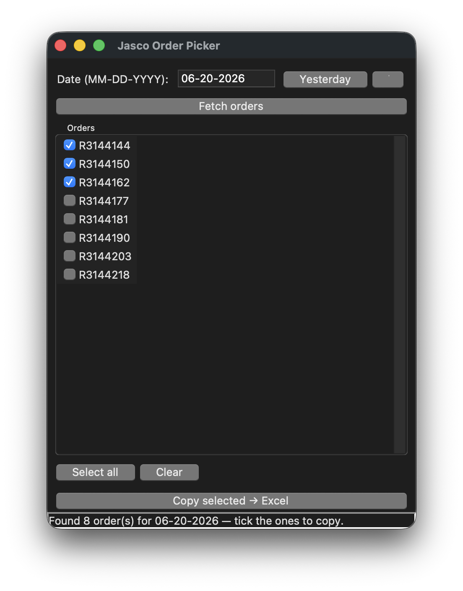

# Jasco Order Sync

**Browser-automation tool that replaces a ~1-hour daily manual data-entry task with a one-command (or one-click) sync.**

Every day, a small wholesale business had to log into the Mississippi Department of
Revenue [Taxpayer Access Point](https://tap.dor.ms.gov/_/) (TAP), open each of the
previous day's submitted retail orders one by one, export it, and hand-copy the line
items into a master Excel workbook. This tool does the whole thing end to end — and
because it dedupes and backs up on every write, it's safe to run unattended on a
schedule.

> **Impact:** ~60 minutes of daily manual copying → ~2 minutes (≈1 hour saved per day).
> Runs fully unattended after a one-time login.

**Stack:** Python · Playwright (headless Chromium) · openpyxl · Microsoft Graph (OneDrive) · Tkinter · systemd · ODS/XLSX

---

<p align="center">
  
  <br>
  <sub><i>The on-demand picker — choose a date, tick which orders to copy, one click to Excel. (Order numbers shown are placeholders.)</i></sub>
</p>

## What it does

1. **Logs into TAP.** A *persistent* browser profile stores the "Trust this device"
   cookie, so the SMS-MFA step only happens on the **first** run — every run after is
   credential-free and unattended.
2. **Filters the order list** to a single day's submitted reserve-inventory orders.
3. **Walks every matching order:** opens it, clicks Export (which fires an `.ods`
   download via a popup), and recovers the order number from the detail page.
4. **Appends the line items** to the `Pending` sheet of `Order.xlsx` — which lives in
   the owner's **OneDrive**, so the server, the desktop picker, and the owner's browser
   all read and write one copy. The layout matches what the owner maintained by hand:

   | Col | Value | Source |
   | --- | ----- | ------ |
   | `A` | Item # | ODS col A |
   | `B` | Name | ODS col B |
   | `C` | `=VLOOKUP(A{row},SizeData!A$1:B$3974,2,FALSE)` | generated formula |
   | `D` | Reserved Quantity | ODS col H |
   | `E` | Order # | scraped from the order page |
   | `F` | Date | the target day, as an Excel date |

5. **Backs up first, never clobbers.** A timestamped copy of the workbook is written to
   `backups/` before any in-place save; if nothing new came in, the workbook is left
   untouched.
6. **Idempotent.** Orders whose number is already in column `E` are skipped, so re-runs
   (or overlap between the scheduled job and the manual picker) can never double-enter.

## How it works

```
          ┌─────────────┐      ┌──────────────┐      ┌──────────────┐
 run.py ─▶│ tap_scraper  │ ───▶ │  ods_parser  │ ───▶ │  xlsx_writer │
 pick.py  │ (Playwright) │ .ods │ (rows, no    │ rows │ (append,     │
          │  login/      │      │  totals row) │      │  dedupe,     │
          │  filter/     │      └──────────────┘      │  back up)    │
          │  iterate/    │                            └──────┬───────┘
          │  export)     │                                   │ local .xlsx
          └─────────────┘                            ┌───────▼────────┐
                                                     │ master_workbook│
                                                     │  (fetch/push,  │──▶ backups/
                                                     │   retry)       │
                                                     └───────┬────────┘
                                                             │ Graph
                                                     ┌───────▼────────┐
                                                     │   onedrive     │──▶ Order.xlsx
                                                     │ (auth, up/down)│    in OneDrive
                                                     └────────────────┘
```

Both entry points (`run.py` and `pick.py`) share the **same** scraper, parser, and
writer, so their output — formatting, backups, the `VLOOKUP` column, the dedupe rule —
is byte-for-byte identical. The only difference is *which* orders they feed in.

## Engineering highlights

The hard part isn't clicking buttons — it's that TAP is a single-page JavaScript app
with a grid that re-renders asynchronously and **reshuffles its row order every time you
enter and leave an order.** Most of the code exists to make automation against that
reliable enough to trust unattended:

- **Select by identity, never by position.** The order grid reorders itself constantly,
  so every order is re-located by its order number on a fresh scan rather than by row
  index — eliminating the classic "clicked the wrong row after a re-render" bug.
- **Wait for *stable* state, not just *a* state.** The grid renders in stages, so a read
  taken too early sees a half-populated list. The scraper polls the row count until it
  stops changing (and until it reaches the known post-filter total) before trusting
  what's on screen — otherwise it would silently drop orders.
- **Guaranteed completeness.** It snapshots the full set of order numbers to process,
  then loops until every one is handled, paginating across list pages and retrying. It
  only gives up after several consecutive empty sweeps, and logs exactly which orders
  (if any) it couldn't reach — so a run is never quietly incomplete.
- **Resilient to flaky clicks.** The live site occasionally swallows a click while the
  grid is still settling; View and Export clicks are retried, and the export download is
  captured from **any** page — including the transient popup window TAP sometimes opens
  it in.
- **Resilient selectors.** Locators are role/name-based (recorded from `playwright
  codegen` against the live site) rather than brittle CSS/XPath, so ordinary markup
  churn doesn't break them.
- **Unattended-safe MFA.** The persistent profile makes MFA one-time. If the trust
  cookie ever expires, an unattended run detects that there's no terminal attached
  (`sys.stdin.isatty()`) and raises a clear `MFARequiredError` instead of hanging
  forever on an input prompt — the log tells you exactly how to re-establish trust.
- **Non-destructive by construction.** The writer copies the previous row's cell
  formatting onto new rows (replacing a manual "format painter" step), dedupes against
  existing order numbers, and snapshots a backup before every in-place save.
- **Safe to co-locate with another bot on the same account.** On the server this job
  shares one Chromium profile — and therefore one MFA trust cookie — with a sibling
  always-on watcher. An `flock`-based mutex that both projects point at the *same* file
  makes them mutually exclusive, and the systemd unit stops and restores the watcher
  around each run, so a crashed or wedged sync can never leave it down.

## Two ways to run

| | `run.py` — the daily job | `pick.py` — the picker |
| --- | --- | --- |
| **When** | Scheduled, unattended (systemd timer, midnight) | On demand, by hand |
| **Scope** | *Every* order from *yesterday* | A date *you* choose, *orders you tick* |
| **UI** | None (headless) | Tkinter window + double-click launcher |
| **For** | Set-and-forget automation | The non-technical owner, no terminal needed |

The picker lists a day's order numbers **without** exporting anything (a cheap
enumeration), so the owner can eyeball them and tick only the ones they want before any
download happens. Because the writer is idempotent, picking an order the daily job
already captured is a safe no-op.

## Tech stack

- **Python 3.11+**
- **[Playwright](https://playwright.dev/python/)** — drives headless Chromium with a
  persistent browser context (the key to one-time MFA)
- **[openpyxl](https://openpyxl.readthedocs.io/)** — reads/writes the `.xlsx` workbook,
  preserving styles and injecting formulas
- **[MSAL](https://learn.microsoft.com/en-us/entra/msal/python/) + Microsoft Graph** —
  device-code sign-in and DriveItem up/download for the workbook in OneDrive
- **Tkinter** — the zero-dependency desktop GUI for the picker
- **systemd** (service + timer) — scheduling for the daily unattended run on a Linux VPS
- **ODS parsing** — reads the spreadsheet TAP exports per order

## Project layout

| File | Role |
| ---- | ---- |
| `run.py` | Daily entrypoint: yesterday → every order → append (unattended) |
| `pick.py` | Interactive Tkinter picker: choose a date, pick which orders |
| `tap_scraper.py` | Playwright driver: login, filter, list/iterate orders, export |
| `ods_parser.py` | Reads rows from an exported ODS, drops the totals row |
| `xlsx_writer.py` | Appends to the `Pending` sheet, dedupes, saves a timestamped backup |
| `master_workbook.py` | Where the workbook lives: fetch → append → push back, with conflict retry |
| `onedrive.py` | Microsoft Graph: device-code sign-in, download/upload, the bookmark link |
| `telegram.py` | Optional success/failure ping for the unattended run |
| `deploy/` | systemd service + timer for the daily schedule |
| `backups/` `downloads/` `logs/` | Output, temp ODS landing zone, run logs (all git-ignored) |

## Setup

```bash
python3 -m venv .venv
source .venv/bin/activate
pip install -r requirements.txt
playwright install chromium

cp .env.example .env
# edit .env: TAP_USERNAME, TAP_PASSWORD, TAP_ACCOUNT_NAME,
#            ONEDRIVE_SHARE_LINK, GRAPH_CLIENT_ID
```

Then sign in to OneDrive once (see the next section for the one-time app
registration) and run it:

```bash
python onedrive.py login   # one-time: prints a code to enter at microsoft.com/devicelogin
python onedrive.py info    # confirms the workbook is found, prints the owner's bookmark

python run.py              # pulls yesterday's orders, appends, backs up
python pick.py             # opens the interactive picker
```

The **first** run opens a real Chromium window and pauses for MFA — complete the SMS
code and tick **Trust this device**, then press Enter. The browser profile is saved
under `.browser_profile/`, so every later run skips login entirely.

## Where the workbook lives

The workbook is a normal `.xlsx` in the owner's OneDrive. Every machine writes that one
copy, and the owner opens it from a bookmarked Excel Online link — which is the whole
point: once the daily job moved to a VPS, a workbook sitting on that server was one the
owner couldn't reach.

It's edited by **download → `openpyxl` → upload**, not through Graph's Excel REST API.
That looks like the low-tech option and is a deliberate choice:

- The Excel API [doesn't support app-only auth](https://learn.microsoft.com/en-us/graph/api/range-update?view=graph-rest-1.0)
  (`Range: update` lists Application permissions as "Not supported"), so it buys no
  credential simplicity over this route.
- Its v1.0 reference states support for **consumer OneDrive isn't available** — only
  business tenants. Round-tripping the file through the DriveItem content endpoints
  works the same on a personal or a work account.
- It keeps `xlsx_writer.py` — and therefore the formatting, the `VLOOKUP` column, and
  the dedupe rule — completely unchanged, so the file the owner opens is byte-identical
  in layout to the one this project has always produced.

**Concurrency.** `run.py` on the VPS and `pick.py` on a desktop are different machines,
so the repo's `flock` can't keep them apart. Every upload carries the `eTag` of the copy
it was based on; if the file changed underneath, Graph refuses with `412` and
`master_workbook` re-downloads and replays the append. That's safe precisely because
`write_orders` is idempotent — the replay re-skips whatever the other machine already
wrote, so a lost update becomes a no-op rather than a duplicate.

<details>
<summary><b>One-time Microsoft app registration</b></summary>

Graph needs an app registration to sign in against. Once, in the
[Azure portal](https://portal.azure.com) → **Microsoft Entra ID** → **App registrations**:

1. **New registration.** Name it anything. Under *Supported account types* pick
   **"Accounts in any organizational directory and personal Microsoft accounts"** —
   that's what lets one registration serve either kind of OneDrive.
2. Leave the redirect URI blank. Register.
3. **Authentication** → **Allow public client flows** → **Yes**. Device-code sign-in
   fails without this.
4. **API permissions** → **Microsoft Graph** → **Delegated** → **Files.ReadWrite** →
   Add. (Grant admin consent if it's a work tenant that requires it.)
5. Copy the **Application (client) ID** into `GRAPH_CLIENT_ID` in `.env`.

No client secret is needed — this is a public client, and the credential that ends up
on disk is a refresh token scoped to the signed-in user.

Then, on **each** machine that runs the sync or the picker:

```bash
python onedrive.py login
```

It prints a short code to enter at `microsoft.com/devicelogin` from any browser (so it
works fine over SSH on a headless VPS). The token is cached in
`.graph_token_cache.json` and renewed silently on every run, so a daily job stays signed
in indefinitely. It only lapses if the password changes or the session is revoked — in
which case the run logs a clear re-auth message and the picker shows it in a dialog.

</details>

<details>
<summary><b>Pointing at the workbook</b></summary>

Set **one** of these in `.env`:

| Variable | How to get it |
| -------- | ------------- |
| `ONEDRIVE_SHARE_LINK` | In OneDrive, right-click the workbook → **Share** → **Copy link**. Easiest — no need to spell out a folder path. |
| `ONEDRIVE_FILE_PATH` | A path from the drive root, e.g. `Documents/Jasco/Order.xlsx`. Useful for scripted setup. |

`python onedrive.py info` confirms the file resolves and prints the `webUrl` — that's
the link to hand the owner to bookmark.

Leaving both unset falls back to **local-file mode** via `ORDER_XLSX_PATH`, which is how
you test a change against a throwaway copy without touching the real workbook.

</details>

## Deployment

<details>
<summary><b>Daily unattended job on a Linux VPS (systemd)</b></summary>

The daily job runs on an always-on Ubuntu VPS rather than a desktop, so nothing depends
on a laptop being awake and logged in. `deploy/` holds a `oneshot` service and the timer
that fires it at local midnight.

```bash
# as root, with the repo at /home/jasco/jasco-order-sync owned by user `jasco`:
cp deploy/order-sync.service deploy/order-sync.timer /etc/systemd/system/
systemctl daemon-reload
systemctl enable --now order-sync.timer

systemctl list-timers order-sync.timer   # confirm the next run
systemctl start order-sync.service       # test now, without waiting for midnight
journalctl -u order-sync.service -f
```

Set the VPS timezone so "midnight" needs no juggling (`timedatectl set-timezone …`), and
install Xvfb — the service runs Chromium under `xvfb-run`, because a fully headless
browser announces itself differently and can re-trigger TAP's MFA.

**Sharing one browser profile with another job.** This deployment sits beside a sibling
always-on watcher that drives the *same* TAP account. They cannot overlap: TAP ties its
session to a per-tab token, and two Chromium trees don't fit in 2 GB of RAM. Two
mechanisms keep them apart:

- The service **stops the watcher before the run and restarts it afterwards**, from
  `ExecStopPost` so the watcher comes back on success, failure, *or* timeout. A
  `TimeoutStartSec` bounds the whole thing, so a run wedged inside Playwright can't keep
  the watcher down indefinitely.
- Both projects point `TAP_LOCK` at **one** lock file, so `_lock()` in `run.py` is a
  mutex across *both* codebases. Anything that starts while the other is live exits
  immediately rather than corrupting the shared profile.

That lets both share a single `.browser_profile` (a symlink) and therefore a single
trusted-device cookie — one MFA bootstrap instead of two. It costs the watcher a few
minutes of downtime a day.

**Notes**
- Pin Playwright to the **same version** both projects use. They share one
  `~/.cache/ms-playwright`, and a different version wants a different Chromium build.
- If a scheduled run logs `MFARequiredError`, the trusted-device cookie expired — run
  `python run.py` manually once (with the other job stopped) to re-establish it.
- If it logs `GraphAuthRequiredError`, the OneDrive sign-in lapsed — run
  `python onedrive.py login` on the VPS once. The daily cadence normally keeps the
  refresh token alive on its own.
- Set `TG_BOT_TOKEN` / `TG_CHAT_ID` to get a Telegram ping on each append or crash;
  there's no terminal to watch on a server. The ping now carries the workbook link, so
  the owner can go straight from the notification to the rows.

</details>

<details>
<summary><b>Previously: macOS (launchd)</b></summary>

Before moving to the VPS, the daily job ran as a `launchd` LaunchAgent on the owner's
Mac at midnight. That approach needed the Mac to be awake and logged in to run, and
skipped any day the machine was off — which is what motivated the move. The LaunchAgent
template was removed in the migration so it can't be loaded by accident and race the
server against the same TAP account; `git log` has it if you want to see it.

</details>

<details>
<summary><b>Interactive picker on a Windows PC</b></summary>

The daily unattended job stays on the server; a desktop machine can run just the
on-demand picker, launched by double-clicking `Order Picker.bat`.

1. **Install Python 3.11+** from [python.org](https://www.python.org/downloads/). On the
   first installer screen tick **"Add python.exe to PATH"** and keep the default
   **"tcl/tk and IDLE"** component (that's Tkinter — the picker needs it).
2. **Clone and set up:**
   ```bat
   git clone https://github.com/adipatel11/jasco-order-sync.git
   cd jasco-order-sync
   python -m venv .venv
   .venv\Scripts\activate
   pip install -r requirements.txt
   playwright install chromium
   ```
3. **Configure `.env`:** copy `.env.example` to `.env` and fill in the TAP credentials,
   `TAP_ACCOUNT_NAME`, `ONEDRIVE_SHARE_LINK`, and `GRAPH_CLIENT_ID`. Note the workbook
   is reached through Graph, **not** through the local OneDrive sync folder — so no
   `C:\Users\...\OneDrive\...` path is involved, and the picker doesn't care whether
   the OneDrive desktop client is installed or signed in.
4. **Sign in to OneDrive once:** `python onedrive.py login`, then follow the code it
   prints. Confirm with `python onedrive.py info`.
5. **Establish the trusted device once** — the picker runs headless and can't do MFA
   itself, so run `python run.py` once from a terminal, complete the code, and tick
   **Trust this device**.
6. **Everyday use:** double-click **`Order Picker.bat`** — no terminal needed. Pick a
   date, **Fetch orders**, tick the ones to copy, **Copy selected → Excel**, then
   **Open workbook in browser** to see the result. Run `Create Desktop Shortcut.bat`
   once to drop a launcher icon on the Desktop.

Each machine keeps its **own** git-ignored `.browser_profile/`, `.env`, and
`.graph_token_cache.json`, so trusting or signing in on one device never affects the
other.

</details>

## A note on security & privacy

This repo is deliberately clean of anything sensitive:

- **Credentials never touch git.** TAP username/password and all paths live only in a
  local `.env` (git-ignored, with a `.env.example` template).
- **No business data is committed.** The live auth session (`.browser_profile/`), the
  cached OneDrive token (`.graph_token_cache.json`, written `0600`), downloaded orders,
  generated workbooks, and logs are all git-ignored.
- **No client secret exists to leak.** OneDrive access uses a public-client
  registration, so the only credential on disk is a refresh token scoped to the
  signed-in user's own files, revocable from their Microsoft account at any time.
- **Account name is a placeholder.** `ACME RETAIL LLC` throughout is a stand-in for the
  real account name, which is supplied per deployment via `TAP_ACCOUNT_NAME`.
